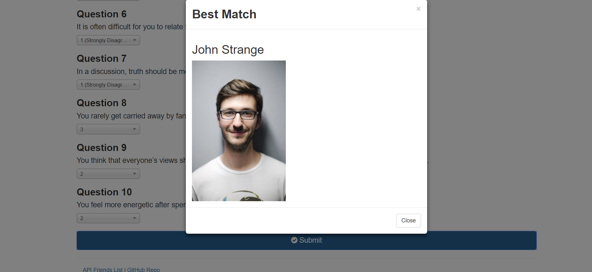

# FriendFinder

This is an activity to build a compatibility-based app.  "FriendFinder" is a full-stack site that will use survey results to find users with the best overrall match.

**Files needed:**
FriendFinder
>-.gitignore  
>-app  
>-data  
>-friends.js  
>-public  
>-home.html  
>-survey.html  
>-routing  
>-apiRoutes.js  
>-htmlRoutes.js  
>-node_modules  
>-package.json  
>-server.js

**What does the app do?**

1. The user will answer 10 questions based on a scale of 1-5 on whether the user agrees or disagrees.

2. The scores will be compared with  the difference between current user's scores against those from other users, quest    - ion by question.

3. The total difference will be calculated and the closest match will be used to find a friend.

**Example:

User 1: [5, 1, 4, 4, 5, 1, 2, 5, 4, 1]

User 2: [3, 2, 6, 4, 5, 1, 2, 5, 4, 1]

Total Difference: 2 + 1 + 2 = 5

**Technologies used:**
>apis  
>express  
>github  
>heroku  
>html  
>javascript  
>bootstrap

**How did it run?**
***Home HTML:***  
(The home interface works well.) All buttons connect and send user to the survey.
![home.html screenshot]

***Survey HTML:***  
(The survey interface works well.) All buttons connect and submit results from the survey.
![survey.html screenshot]

***Submitting:***  
(The submit button works well.) The submit button enters user information and sends user a message showing submission of the survey.
![submitting screenshot]

***Best Match:***  
(The Best match link works well.) Users are connected to another user based on scores. The user is then  sent a picture with the name of their match.
![Best Match screenshot]

Anita McFarland